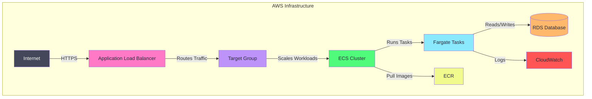

# Quick Prod AWS Infra 🚀  

An **opinionated starting point** for rapidly deploying applications on AWS using **Terraform** and **best practices**. Supports multiple environments (staging/production) with automated deployments.

## **⚡ Goal**  
This repository provides an automated **infrastructure setup** that helps teams deploy applications **quickly and efficiently** across multiple environments.

## **🌍 Environment Setup**

This infrastructure supports two environments:
- **Staging** (`staging` branch) - For testing and validation
- **Production** (`main` branch) - For production workloads

Each environment is isolated with its own:
- VPC and networking components
- Database instances
- Load balancers and target groups
- ECS clusters and services
- Security groups and IAM roles

## **🔧 Setup Instructions**  

### **1️⃣ Prerequisites**  
Ensure you have the following installed:  
- [AWS CLI](https://docs.aws.amazon.com/cli/latest/userguide/install-cliv2.html)  
- [Terraform](https://developer.hashicorp.com/terraform/downloads)  
- [Docker](https://www.docker.com/get-started)  

### **2️⃣ Create an AWS User for Terraform**
Create an IAM user with appropriate permissions:

```sh
# Option 1 (Recommended for production): Create a user with specific permissions
# Use AWS Management Console to create an IAM user with only the permissions needed:
# - EC2, VPC, ECS, RDS, ECR, CloudWatch, IAM (limited), S3 (limited)

# Option 2 (Quick start for development/testing): Create an admin user
aws iam create-user --user-name terraform-deployer
aws iam attach-user-policy --user-name terraform-deployer --policy-arn arn:aws:iam::aws:policy/AdministratorAccess
aws iam create-access-key --user-name terraform-deployer
```

⚠️ **Security Note**: For production environments, narrow down permissions to follow least privilege principles. The admin user approach should only be used for initial development/testing.

### **3️⃣ Clone the Repository**  
```sh
git clone https://github.com/your-username/quick-prod-aws-infra.git
cd quick-prod-aws-infra
```

### **4️⃣ Configure AWS Credentials**  
Configure AWS credentials for both environments using the user created in step 2:
```sh
# For staging
aws configure --profile quick-prod-staging

# For production
aws configure --profile quick-prod-prod
```

### **5️⃣ Select Environment and Initialize**
Choose the environment to deploy using Terraform workspaces:
```sh
# Navigate to the terraform directory
cd terraform

# Initialize Terraform
terraform init

# For staging environment
terraform workspace new staging  # Only needed first time
terraform workspace select staging
terraform plan  # Variables should be managed via Terraform Cloud or custom .tfvars
terraform apply -auto-approve

# For production environment
terraform workspace new production  # Only needed first time
terraform workspace select production
terraform plan  # Variables should be managed via Terraform Cloud or custom .tfvars
terraform apply -auto-approve
```

**Note**: Environment variables should be managed either through Terraform Cloud or by creating your own environment-specific .tfvars files.

### **6️⃣ Deploy Your Application**  
Deployments are automated via GitHub Actions. Simply push to:
- `staging` branch for staging deployment
- `main` branch for production deployment

---

## **🏗 Architecture Overview**  



## **⚖️ Trade-offs and Security Considerations**

### **Network Architecture**
⚠️ **Simplified Network Configuration**: This setup intentionally places services in public subnets to avoid NAT gateway costs.
- Services (except databases) are deployed in public subnets
- Security relies primarily on properly configured security group rules
- Inbound traffic is restricted through security groups

### **Security Concerns**
🚨 **Limited Network Isolation**: With services in public subnets, this setup has less isolation than a traditional architecture.
- Databases remain in private subnets for security
- Application services are directly exposed to public subnets
- Heavily dependent on properly configured security groups
- Higher risk profile compared to a traditional private subnet + NAT architecture

### **Cost vs. Security Balance**
⚠️ **Optimized for Quick Deployment and Cost**: 
- Well-suited for MVPs, startups, and non-critical applications
- May require additional security hardening for compliance-sensitive workloads

## **📁 Repository Structure**
```
quick-prod-aws-infra/
├── .github/
│   └── workflows/
│       └── deploy.yml
├── terraform/
│   ├── main.tf         
│   ├── variables.tf    
│   └── modules/
│       ├── networking/
│       ├── security/
│       ├── database/
│       └── ecs/
├── docs/
│   └── workflow-setup.md
└── README.md
```

**Note**: Environment-specific variables should be managed through Terraform Cloud or by creating custom .tfvars files for your environments.

## **🛠 Future Enhancements**  
- Implement **blue-green deployments**
- Add **automatic database backups**
- Support for **canary deployments**
- 🚨 **Move services to private subnets with NAT gateways** for improved security isolation
- ⚠️ **Implement network flow logs** for better security monitoring
- Add **cross-region failover** (lower priority)

## **📜 License**  
This project is licensed under the **MIT License**. See [LICENSE](LICENSE) for details.

## **👥 Contributions**  
Feel free to open issues or submit PRs to improve this repo!