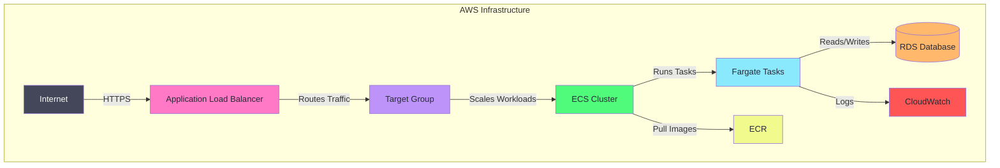

# Quick Prod AWS Infra 🚀  

An **opinionated starting point** for rapidly deploying applications on AWS using **Terraform** and **best practices**. Supports multiple environments (staging/production) with automated deployments.

## **⚡ Goal**  
This repository provides an automated **infrastructure setup** that helps teams deploy applications **quickly and efficiently** across multiple environments.

## **🌍 Environment Setup**

This infrastructure supports two environments:
- **Staging** (`staging` branch) - For testing and validation
- **Production** (`main` branch) - For production workloads

Each environment is isolated with its own:
- VPC and networking components
- Database instances
- Load balancers and target groups
- ECS clusters and services
- Security groups and IAM roles

## **🔧 Setup Instructions**  

### **1️⃣ Prerequisites**  
Ensure you have the following installed:  
- [AWS CLI](https://docs.aws.amazon.com/cli/latest/userguide/install-cliv2.html)  
- [Terraform](https://developer.hashicorp.com/terraform/downloads)  
- [Docker](https://www.docker.com/get-started)  

### **2️⃣ Clone the Repository**  
```sh
git clone https://github.com/your-username/quick-prod-aws-infra.git
cd quick-prod-aws-infra
```

### **3️⃣ Configure AWS Credentials**  
Configure AWS credentials for both environments:
```sh
# For staging
aws configure --profile quick-prod-staging

# For production
aws configure --profile quick-prod-prod
```

### **4️⃣ Select Environment and Initialize**
Choose the environment to deploy:
```sh
# For staging
cd environments/staging
terraform init
terraform workspace new staging
terraform plan -var-file=staging.tfvars
terraform apply -var-file=staging.tfvars -auto-approve

# For production
cd environments/production
terraform init
terraform workspace new production
terraform plan -var-file=prod.tfvars
terraform apply -var-file=prod.tfvars -auto-approve
```

### **5️⃣ Deploy Your Application**  
Deployments are automated via GitHub Actions. Simply push to:
- `staging` branch for staging deployment
- `main` branch for production deployment

---

## **🏗 Architecture Overview**  



Each environment contains:
- **Isolated VPC** with public/private subnets
- **ALB** for traffic routing
- **ECS Fargate** for container workloads
- **RDS** for database operations
- **AWS MQ** (optional) for message brokering

## **📁 Repository Structure**
```
quick-prod-aws-infra/
├── .github/
│   └── workflows/
│       └── deploy.yml
├── terraform/
│   ├── main.tf         
│   ├── variables.tf    
│   ├── terraform.tfvars
│   └── modules/
│       ├── networking/
│       ├── security/
│       ├── database/
│       └── ecs/
├── docs/
│   └── workflow-setup.md
└── README.md
```

## **🛠 Future Enhancements**  
- Add **cross-region failover**
- Implement **blue-green deployments**
- Add **automatic database backups**
- Support for **canary deployments**

## **📜 License**  
This project is licensed under the **MIT License**. See [LICENSE](LICENSE) for details.

## **👥 Contributions**  
Feel free to open issues or submit PRs to improve this repo!  
